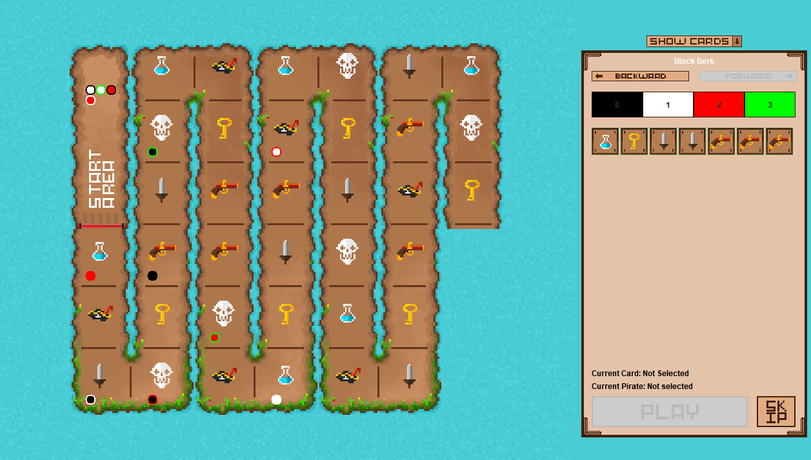

# CS534 Fall 2017 Project

Java/Swing application of Cartagena board game.

Project defined [here](http://aktemur.github.io/cs534/project_cartagena.html)

Time-lapse gameplay video of our game:

[Video Link](https://www.youtube.com/watch?v=WIWXM6XtBrU)

Screenshot of our game:

** Asaf Koray BOLAT / Berk ÜĞÜDÜR **

## Compile and Run

Your jar files should be in the same folder with **img folder**.

For example:

../Cartagena/CartagenaSingle.jar

../Cartagena/img

### Singleplayer
You can play on same computer with starting Singleplayer Game.

Start the Singleplayer Game

`java -jar CartagenaSingle.jar`

### Multiplayer
If you want to be Server on Multiplayer game, you first start Server and fill parameters on console.

Start the MultiPlayer Server

`java -jar CartagenaServer.jar`

If you want to be Client on Multiplayer game, you can start Client and write your name and ServerIP.

Start the MultiPlayer Client

`java -jar CartagenaClient.jar`

## Gameplay
Each player can make **2 move** in their turn.

First move can not be skip. However player can skip his/her second move.

Game will be finished if a player's all pirates reached to boat.

Player can choose directions as follow:

- **Forward**

    Choose **card** and **pirate**.
    
    Press play button.
- **Backward**

    Choose pirate.
    
    Press play button.
    
Player can look at other players card with **Show Cards Button**

### Player
Every player has a unique color.

### Pirates
Every pirate has a unique color.

Pirate's inner color is the same as player that pirate belongs to.

Pirate's outer color is pirate color.

## Report
More detailed report is [here](report.md)
